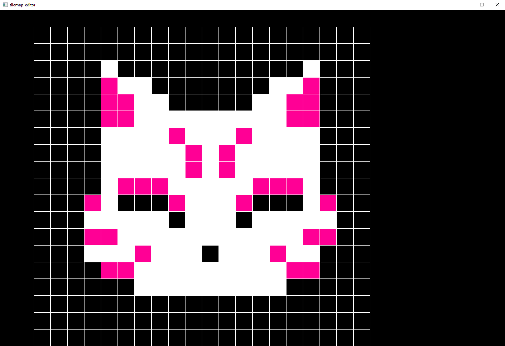
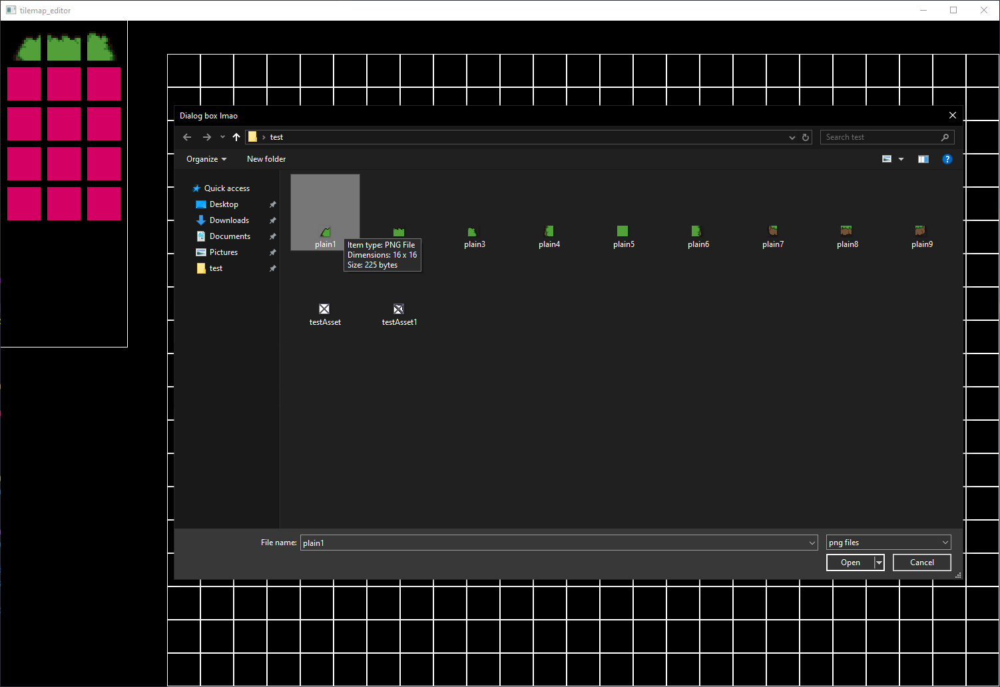
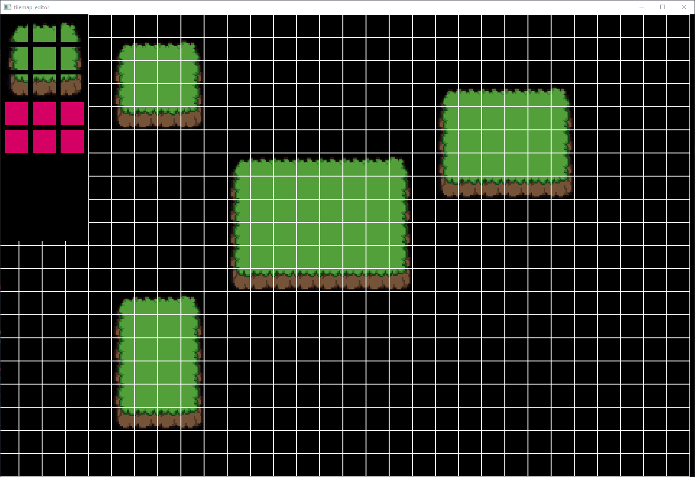

<!-- 

 -->

tile_map editor
The point of this app is to make maps for 2D games.

---

Features:
- Moveable Grid
	By pressing WASD keys you can move the grid

- Loading textures to the pallete
	Via <windows.h> it's possible to open the file explorer and choose the texture
	

- Cells having a texture
	

  
- A list of all uploaded textures and an ability of choosing and changing tiles

---

Roadmap:
- Changing the size of the grid (Zoom)
- Extending the canvas
- Optimization of selecting tiles or buttons
- Optimization of moving the grid

